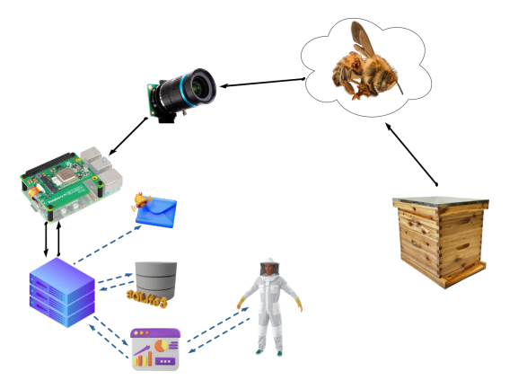
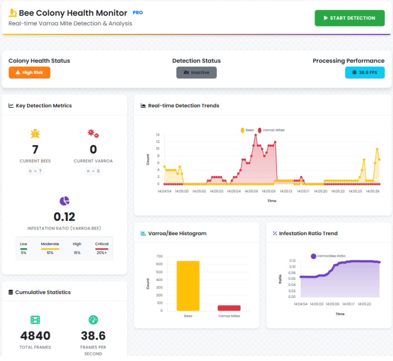

# Varroa Detection Using Deep Learning: An Embedded Real-Time Detection System for Beekeeping

[](https://python.org)
[](https://github.com/ultralytics/ultralytics)
[](LICENSE)
[]()

*Final Year Project - University of Greenwich*


## Project Overview

This project addresses the ongoing threat posed by *Varroa destructor* mites to honeybee populations by introducing a non-invasive, real-time detection system using deep learning. Traditional monitoring methods are labour-intensive, inconsistent, and delayed in response, leading to late-stage infestations and colony decline.

The proposed solution integrates a YOLOv8-based object detection model with edge AI hardware, allowing real-time processing on low-power devices in remote field environments. The system enables continuous monitoring without disrupting hive activity and provides automated alerts when infestation thresholds are exceeded.

The detection model was trained on a dataset of over 15,000 annotated images and achieves an mAP@0.5 of 89.8% on unseen test data. It is deployed on a Raspberry Pi 5 coupled with the Hailo-8L accelerator for efficient inference, with a web-based dashboard built using Flask for live visualisation and local data logging.

This approach contributes to precision beekeeping by enabling early intervention through embedded vision, enhancing colony management without the need for manual inspection.

### System Overview Animation 



## Visual Demo

The following screenshots demonstrate live detection of Varroa mites within the real-time web interface. The dashboard serves as the primary user interface for monitoring colony health in real time. It provides a clear and accessible overview of key metrics derived from the detection system, supporting informed decision-making in the field. Designed with responsiveness and simplicity in mind, the interface presents detection outcomes, health indicators and system status updates in an intuitive layout.

> *Note: For best results, use a webcam or hive tunnel camera positioned at the hive entrance under stable lighting conditions.*

### Sample Detection Interface


### Real-time dynamic dashboard




### Risk Classification Logic

| Risk Level | Infestation Ratio |
|------------|-------------------|
| Low        | < 5%              | 
| Moderate   | 5–10%              |
| High       | 10–15%             |
| Critical   | > 15%             |


### Summary of Key Evaluation Metrics

| Model   | Precision | Recall | F1-Score | mAP\@0.5 |
| ------- | --------- | ------ | -------- | -------- |
| YOLOv8n | 0.861     | 0.842  | 0.84     | 0.898    |


# Technology Stack & System Architecture

## Core Technologies

### Hardware Components
- **Raspberry Pi 5** (8GB RAM, 2.4GHz quad-core Cortex-A76)
  - Main computing platform hosting Flask backend and system control
  - Provides USB 3.0 and PCIe 2.0 interfaces for peripherals
  - Requires 27W USB-C power supply (5V/5A) for stable operation

- **Hailo-8L AI Accelerator** (M.2 Module, 13 TOPS)
  - Hardware acceleration for YOLOv8n neural network inference
  - Connects via PCIe M.2 slot for low-latency AI processing
  - Enables real-time object detection at ~10-15 FPS

- **Raspberry Pi HQ Camera** (Sony IMX477, 12.3MP)
  - High-resolution video capture via CSI-2 interface
  - Configured for 640×640 input compatible with YOLOv8n model
  - Provides detailed imagery for detecting tiny Varroa mites on bees

### Software Stack

#### Machine Learning & Inference
- **YOLOv8n (Ultralytics)** - Lightweight object detection model
- **Hailo Model Zoo & Dataflow Compiler** - Model optimization and quantization
- **ONNX** - Intermediate model format for hardware conversion
- **Hailo Runtime Environment** - Python API for accelerator integration

#### Backend & Data Management
- **Flask** - Web server framework for REST API and system orchestration
- **SQLite** - Embedded database for session logging and historical data
- **Python 3.x** - Primary programming language with multiprocessing support

#### Frontend & Visualization
- **HTML/CSS/JavaScript** - Responsive web dashboard
- **Chart.js/D3.js** - Real-time data visualization and time-series plotting
- **AJAX/Fetch API** - Asynchronous data polling for live updates

#### System & Media Processing
- **OpenCV/GStreamer** - Camera interface and frame processing
- **Linux (Raspberry Pi OS)** - Operating system with hardware driver support
- **systemd** - Service management for automatic startup and recovery

## System Communication Flow

```
┌─────────────────┐    CSI-2     ┌──────────────────┐
│   HQ Camera     │─────────────▶│  Raspberry Pi 5  │
│  (IMX477)       │              │                  │
└─────────────────┘              │  ┌─────────────┐ │
                                 │  │ Detection   │ │
┌─────────────────┐    PCIe      │  │ Engine      │ │
│  Hailo-8L       │◀─────────────┤  │ (subprocess)│ │
│  Accelerator    │              │  └─────────────┘ │
│  (13 TOPS)      │              │         │        │
└─────────────────┘              │  ┌─────────────┐ │
                                 │  │ Flask       │ │
                                 │  │ Backend     │ │
                                 │  │ (REST API)  │ │
                                 │  └─────────────┘ │
                                 │         │        │
                                 │  ┌─────────────┐ │
                                 │  │ SQLite      │ │
                                 │  │ Database    │ │
                                 │  └─────────────┘ │
                                 └──────────────────┘
                                          │ HTTP/JSON
                                          ▼
                                 ┌──────────────────┐
                                 │  Web Dashboard   │
                                 │  (HTML/CSS/JS)   │
                                 └──────────────────┘
```

### Data Flow Pipeline

1. **Image Capture**: Camera continuously streams frames via CSI-2 to Raspberry Pi
2. **Preprocessing**: Detection engine resizes frames to 640×640 and normalizes pixel values
3. **AI Inference**: Hailo-8L accelerator processes frames through YOLOv8n model
4. **Result Processing**: Detection engine parses bounding boxes, counts objects, calculates metrics
5. **Data Logging**: Backend receives structured logs, updates statistics, stores to SQLite
6. **API Serving**: Flask exposes REST endpoints (`/getStats`, `/getTimeSeries`) with JSON responses
7. **Frontend Updates**: Dashboard polls API every 1-2 seconds, updates charts and indicators
8. **Session Management**: System tracks detection sessions, generates email reports, handles recovery

### Inter-Process Communication

- **Detection Subprocess ↔ Flask Backend**: Text-based logging via stdout parsing
- **Backend ↔ Database**: SQL queries through Python SQLite interface
- **Backend ↔ Frontend**: RESTful HTTP APIs with JSON payloads
- **Hardware ↔ Software**: Hailo Python SDK for accelerator control, OpenCV for camera access

---

# Installation & Deployment Guide

## Prerequisites

### Hardware Requirements
- Raspberry Pi 5 (8GB recommended) with official cooling case
- Hailo-8L AI Accelerator (M.2 module)
- Raspberry Pi HQ Camera with Sony IMX477 sensor
- 27W USB-C power supply (5V/5A minimum)
- MicroSD card (64GB+, Class 10)
- M.2 HAT or compatible PCIe adapter for Hailo-8L

### Development Environment (for model training/compilation)
- NVIDIA GPU (RTX 4090 used for training, Titan RTX for compilation)
- Ubuntu 20.04+ or WSL2 environment
- CUDA toolkit and drivers

## Step 1: Raspberry Pi Setup

### 1.1 Flash Raspberry Pi OS
```bash
# Download Raspberry Pi Imager
# Flash 64-bit Raspberry Pi OS (Bookworm) to SD card
# Enable SSH, set username/password during imaging
```

### 1.2 Initial System Configuration
```bash
# Update system packages
sudo apt update && sudo apt upgrade -y

# Enable camera interface
sudo raspi-config
# Navigate to Interface Options → Camera → Enable

# Install essential packages
sudo apt install -y python3-pip python3-venv git cmake build-essential
sudo apt install -y libopencv-dev python3-opencv gstreamer1.0-tools
```

### 1.3 Hardware Installation
```bash
# Power down Pi completely
sudo shutdown -h now

# Install Hailo-8L M.2 module to M.2 HAT
# Connect M.2 HAT to Pi's PCIe slot
# Connect HQ Camera to CSI port
# Power on with 27W adapter
```

## Step 2: Hailo-8L Setup

### 2.1 Install Hailo Software
```bash
# Download Hailo software suite
wget https://hailo.ai/downloads/hailo-8-raspberry-pi/
# Follow specific version instructions from Hailo documentation

# Install Hailo runtime
sudo dpkg -i hailort_X.X.X_arm64.deb
sudo apt install -f

# Install Python API
pip3 install hailort
```

### 2.2 Verify Hailo Installation
```bash
# Check Hailo device detection
lspci | grep Hailo

# Test basic functionality
python3 -c "from hailo_platform import HEF; print('Hailo import successful')"
```

## Step 3: Model Preparation

### 3.1 YOLOv8n Training Environment (Development Machine)
```bash
# Create virtual environment
python -m venv yolo_env
source yolo_env/bin/activate  # Linux/WSL
# yolo_env\Scripts\activate   # Windows

# Install Ultralytics YOLO
pip install ultralytics torch torchvision

# Train model (requires dataset)
yolo train data=varroa_dataset.yaml model=yolov8n.pt epochs=100 imgsz=640
```

### 3.2 Model Conversion for Hailo (Ubuntu/WSL2)
```bash
# Install Hailo Model Zoo
pip install hailo-model-zoo

# Export to ONNX
yolo export model=best.pt format=onnx imgsz=640

# Convert to Hailo format (.hef)
hailo model-zoo compile yolov8n --hw-arch hailo8l --input-shape 640,640,3
# This generates the .hef file for deployment
```

## Step 4: Application Installation

### 4.1 Clone Repository
```bash
# On Raspberry Pi
git clone https://github.com/yourusername/varroa-detection-system.git
cd varroa-detection-system
```

### 4.2 Python Environment Setup
```bash
# Create virtual environment
python3 -m venv venv
source venv/bin/activate

# Install dependencies
pip install -r requirements.txt
```

### 4.3 Required Python Packages (`requirements.txt`)
```txt
flask==2.3.3
opencv-python==4.8.1.78
numpy==1.24.3
sqlite3
hailort>=4.15.0
ultralytics>=8.0.0
pillow>=10.0.0
python-dotenv>=1.0.0
smtplib-ssl>=1.0.0
```

### 4.4 Configuration Files
```bash
# Create configuration directory
mkdir config

# Database initialization
python3 scripts/init_database.py

# Copy model file
cp /path/to/your/yolov8n_varroa.hef models/

# Set up environment variables
cp .env.example .env
# Edit .env with your email settings, thresholds, etc.
```

## Step 5: System Configuration

### 5.1 Camera Configuration
```bash
# Test camera functionality
libcamera-still -o test.jpg

# Configure camera settings in config/camera_config.json
{
    "resolution": [640, 640],
    "framerate": 15,
    "exposure_mode": "auto",
    "awb_mode": "auto"
}
```

### 5.2 Service Setup (Auto-start)
```bash
# Create systemd service
sudo nano /etc/systemd/system/varroa-detection.service
```

```ini
[Unit]
Description=Varroa Detection System
After=network.target

[Service]
Type=simple
User=pi
WorkingDirectory=/home/pi/varroa-detection-system
Environment=PATH=/home/pi/varroa-detection-system/venv/bin
ExecStart=/home/pi/varroa-detection-system/venv/bin/python app.py
Restart=always
RestartSec=10

[Install]
WantedBy=multi-user.target
```

```bash
# Enable and start service
sudo systemctl enable varroa-detection.service
sudo systemctl start varroa-detection.service
```

## Step 6: Testing & Validation

### 6.1 Hardware Tests
```bash
# Test camera capture
python3 tests/test_camera.py

# Test Hailo accelerator
python3 tests/test_hailo.py

# Test model inference
python3 tests/test_inference.py
```

### 6.2 System Integration Test
```bash
# Start the application
python3 app.py

# Access dashboard at http://raspberry-pi-ip:5000
# Verify live detection, database logging, email alerts
```

### 6.3 Performance Monitoring
```bash
# Monitor system resources
htop

# Check inference performance
python3 scripts/benchmark_model.py

# Expected performance: 10-15 FPS at 640×640 resolution
```

## Step 7: Optional Enhancements

### 7.1 Remote Access Setup
```bash
# Install VNC for remote desktop
sudo apt install realvnc-vnc-server

# Or use SSH tunneling for web access
ssh -L 8080:localhost:5000 pi@raspberry-pi-ip
```

### 7.2 Backup & Recovery
```bash
# Automated database backup
crontab -e
# Add: 0 2 * * * /home/pi/scripts/backup_database.sh
```

## Troubleshooting

### Common Issues
- **Camera not detected**: Check CSI cable connection, enable camera in raspi-config
- **Hailo not found**: Verify PCIe connection, check lspci output
- **Low FPS**: Reduce resolution, check power supply (ensure 5A capability)
- **Model loading errors**: Verify .hef file path and Hailo runtime version compatibility

### Log Files
```bash
# System logs
sudo journalctl -u varroa-detection.service -f

# Application logs
tail -f logs/detection.log

# Flask debug mode
export FLASK_DEBUG=1
python3 app.py
```


