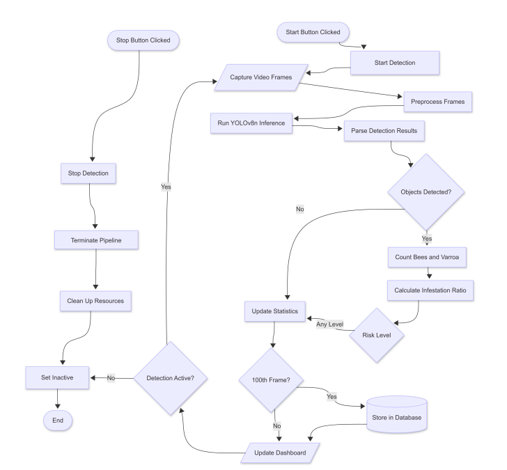

# Varroa Detection Using Deep Learning: An Embedded Real-Time Detection System for Beekeeping

[](https://python.org)
[](https://github.com/ultralytics/ultralytics)
[](LICENSE)
[]()

*Final Year Project - University of Greenwich*

📄 **[Read the Full Research Paper](docs/001252261-FYP_Report.pdf)**

## Project Overview

This project addresses the ongoing threat posed by *Varroa destructor* mites to honeybee populations by introducing a non-invasive, real-time detection system using deep learning. Traditional monitoring methods are labour-intensive, inconsistent, and delayed in response, leading to late-stage infestations and colony decline.

The proposed solution integrates a YOLOv8-based object detection model with edge AI hardware, allowing real-time processing on low-power devices in remote field environments. The system enables continuous monitoring without disrupting hive activity and provides automated alerts when infestation thresholds are exceeded.

The detection model was trained on a dataset of over 15,000 annotated images and achieves an mAP@0.5 of 89.8% on unseen test data. It is deployed on a Raspberry Pi 5 coupled with the Hailo-8L accelerator for efficient inference, with a web-based dashboard built using Flask for live visualisation and local data logging.

This approach contributes to precision beekeeping by enabling early intervention through embedded vision, enhancing colony management without the need for manual inspection.

### System Overview Animation 


## Visual Demo

The following screenshots demonstrate live detection of Varroa mites within the real-time web interface. The dashboard serves as the primary user interface for monitoring colony health in real time. It provides a clear and accessible overview of key metrics derived from the detection system, supporting informed decision-making in the field. Designed with responsiveness and simplicity in mind, the interface presents detection outcomes, health indicators and system status updates in an intuitive layout.

> *Note: For best results, use a webcam or hive tunnel camera positioned at the hive entrance under stable lighting conditions.*

### Sample Detection Interface


### Real-time dynamic dashboard


# Technology Stack & System Architecture

## Core Technologies

### Hardware Components
- **Raspberry Pi 5** (8GB RAM, 2.4GHz quad-core Cortex-A76)
  - Main computing platform hosting Flask backend and system control
  - Provides USB 3.0 and PCIe 2.0 interfaces for peripherals
  - Requires 27W USB-C power supply (5V/5A) for stable operation

- **Hailo-8L AI Accelerator** (M.2 Module, 13 TOPS)
  - Hardware acceleration for YOLOv8n neural network inference
  - Connects via PCIe M.2 slot for low-latency AI processing
  - Enables real-time object detection at ~10-15 FPS

- **Raspberry Pi HQ Camera** (Sony IMX477, 12.3MP)
  - High-resolution video capture via CSI-2 interface
  - Configured for 640×640 input compatible with YOLOv8n model
  - Provides detailed imagery for detecting tiny Varroa mites on bees

### Software Stack

#### Machine Learning & Inference
- **YOLOv8n (Ultralytics)** - Lightweight object detection model
- **Hailo Model Zoo & Dataflow Compiler** - Model optimization and quantization
- **ONNX** - Intermediate model format for hardware conversion
- **Hailo Runtime Environment** - Python API for accelerator integration

#### Backend & Data Management
- **Flask** - Web server framework for REST API and system orchestration
- **SQLite** - Embedded database for session logging and historical data
- **Python 3.9** - Primary programming language with multiprocessing support

#### Frontend & Visualization
- **HTML/CSS/JavaScript** - Responsive web dashboard
- **Chart.js/D3.js** - Real-time data visualization and time-series plotting
- **AJAX/Fetch API** - Asynchronous data polling for live updates

#### System & Media Processing
- **OpenCV/GStreamer** - Camera interface and frame processing
- **Linux (Raspberry Pi OS)** - Operating system with hardware driver support
- **systemd** - Service management for automatic startup and recovery

## System Communication Flow



## Testing & Validation Results

The system underwent comprehensive unit, integration, and performance testing:

- **Code Coverage**: 80% backend routes, 100% integration components
- **Performance**: 26-31 FPS average, exceeding 15 FPS real-time requirement  
- **Reliability**: All API endpoints and detection workflows validated
- **Hardware**: Tested successfully on Raspberry Pi 5 + Hailo-8L

All tests confirm the system meets design specifications for accuracy and real-time performance.

# Installation & Deployment Guide

## Prerequisites

### Hardware Requirements
- Raspberry Pi 5 (8GB recommended) with official cooling case
- Hailo-8L AI Accelerator (M.2 module)
- Raspberry Pi HQ Camera with Sony IMX477 sensor
- 27W USB-C power supply (5V/5A minimum)
- MicroSD card (64GB+, Class 10)
- M.2 HAT or compatible PCIe adapter for Hailo-8L

### Development Environment (for model training/compilation)
- NVIDIA GPU (RTX 4090 used for training, Titan RTX for compilation)
- Ubuntu 20.04+ or WSL2 environment
- CUDA toolkit and drivers

## Step 1: Raspberry Pi Setup

### 1.1 Flash Raspberry Pi OS
```bash
# Download Raspberry Pi Imager
# Flash 64-bit Raspberry Pi OS (Bookworm) to SD card
# Enable SSH, set username/password during imaging
```

### 1.2 Initial System Configuration
```bash
# Update system packages
sudo apt update && sudo apt upgrade -y

# Enable camera interface
sudo raspi-config
# Navigate to Interface Options → Camera → Enable

# Install essential packages
sudo apt install -y python3-pip python3-venv git cmake build-essential
sudo apt install -y libopencv-dev python3-opencv gstreamer1.0-tools
```

### 1.3 Hardware Installation
```bash
# Power down Pi completely
sudo shutdown -h now

# Install Hailo-8L M.2 module to M.2 HAT
# Connect M.2 HAT to Pi's PCIe slot
# Connect HQ Camera to CSI port
# Power on with 27W adapter
```

## Step 2: Hailo-8L Setup

### 2.1 Install Hailo Software
```bash
# Download Hailo software suite
wget https://hailo.ai/downloads/hailo-8-raspberry-pi/
# Follow specific version instructions from Hailo documentation

# Install Hailo runtime
sudo dpkg -i hailort_X.X.X_arm64.deb
sudo apt install -f

# Install Python API
pip3 install hailort
```

### 2.2 Verify Hailo Installation
```bash
# Check Hailo device detection
lspci | grep Hailo

# Test basic functionality
python3 -c "from hailo_platform import HEF; print('Hailo import successful')"
```

## Step 3: System Setup

### 3.1 Clone Repository
```bash
# On Raspberry Pi
git clone https://github.com/emira2003/bee-mite-detector
```

```bash
# Enter the cloned folder
cd bee-mite-detector
```
```bash
# Create the Environmet for Hailo
source setup_env.sh
```
```bash
# Install flask in order to run the Server
pip install flask python-dotenv
```
```bash
# Initialise the database
python bee_health_db.py
```
```bash
# Run the server 
python app.py
```
After completing these steps, the system should be running successfully. Flask will display startup messages in the terminal including a link such as http://0.0.0.0:5000 or http://127.0.0.1:5000. Copy this link and paste it into your web browser, or access it from another device on the same network using http://[raspberry-pi-ip]:5000. You should now be able to see and interact with the real-time Varroa detection dashboard.

## References

- [Ultralytics YOLOv8](https://github.com/ultralytics/ultralytics)
- [Hailo Model Zoo](https://github.com/hailo-ai/hailo_model_zoo)
- [hailo-rpi5-examples](https://github.com/hailo-ai/hailo-rpi5-examples)
- Public datasets hosted on [Roboflow](https://roboflow.com)


