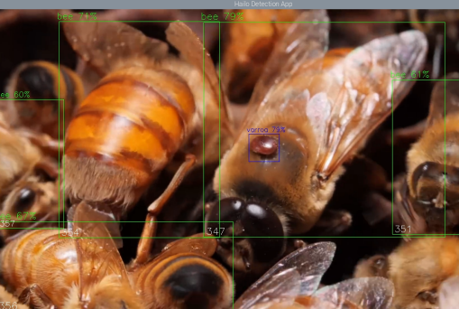

# Varroa Detection Using Deep Learning: An Embedded Real-Time Detection System for Beekeeping

*Final Year Project - University of Greenwich*

## Project Overview

This project addresses the ongoing threat posed by *Varroa destructor* mites to honeybee populations by introducing a non-invasive, real-time detection system using deep learning. Traditional monitoring methods are labour-intensive, inconsistent, and delayed in response, leading to late-stage infestations and colony decline.

The proposed solution integrates a YOLOv8-based object detection model with edge AI hardware, allowing real-time processing on low-power devices in remote field environments. The system enables continuous monitoring without disrupting hive activity and provides automated alerts when infestation thresholds are exceeded.

The detection model was trained on a dataset of over 15,000 annotated images and achieves an mAP@0.5 of 89.8% on unseen test data. It is deployed on a Raspberry Pi 5 coupled with the Hailo-8L accelerator for efficient inference, with a web-based dashboard built using Flask for live visualisation and local data logging.

This approach contributes to precision beekeeping by enabling early intervention through embedded vision, enhancing colony management without the need for manual inspection.

### System Overview Animation

## Visual Demo

The following screenshots demonstrate live detection of Varroa mites within the real-time web interface. The dashboard displays bounding boxes around detected objects, tracks infestation ratios per session, and automatically classifies risk levels based on configured thresholds.

> *Note: For best results, use a webcam or hive tunnel camera positioned at the hive entrance under stable lighting conditions.*

### Sample Detection Interface

### Risk Classification Table

| Risk Level | Infestation Ratio |
|------------|-------------------|
| Low        | < 5%              |
| Moderate   | 5% – 10%           |
| High       | 10% – 15%          |
| Critical   | > 15%             | 

